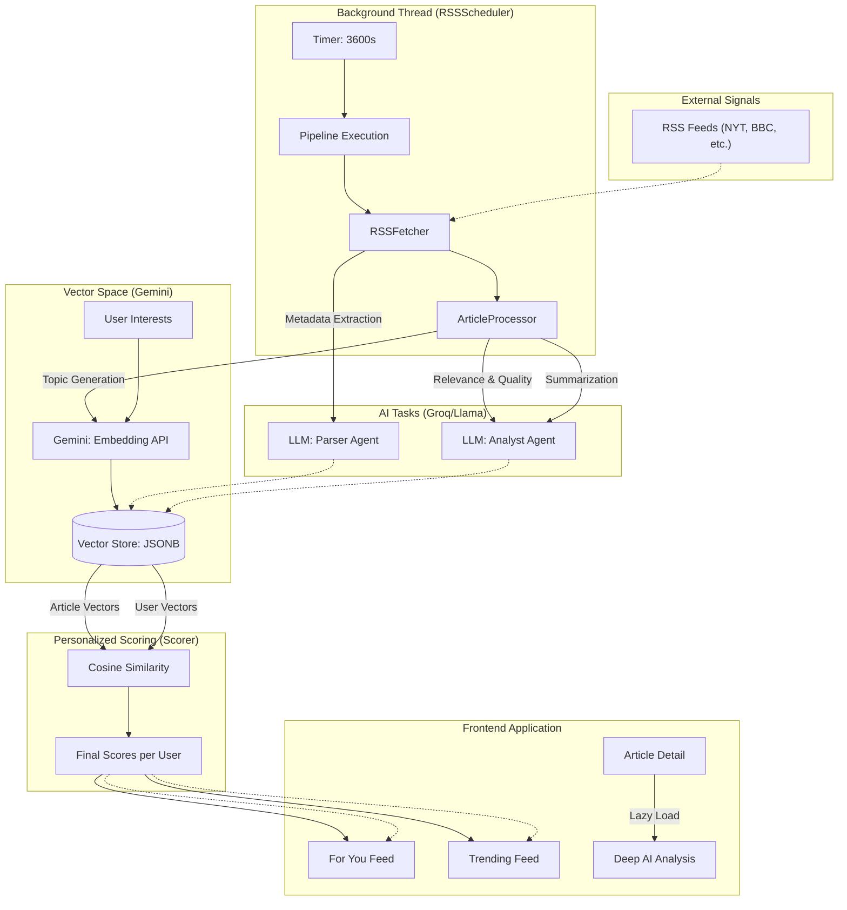

# FeedMe: An AI-Powered Personalized News Aggregator

**Course:** Data Structures and Algorithms — AI Seminar Project  
**Author:** AroMino Rakotoarijaona  
**Date:** June 2026  

---

## Abstract

FeedMe is a full-stack web application that automates the discovery, analysis, and ranking of news articles through a multi-stage AI pipeline. The system continuously ingests content from RSS feeds, uses a Large Language Model (LLM) to extract structured metadata from raw web content, enriches articles with quality and relevance scores, and finally applies semantic vector similarity to compute a personalized relevance score for each user. The result is a real-time, context-aware news feed — a **For You** stream driven by individual interests and a **Trending** stream driven by global content signals. This report presents the architecture, the design of each AI pipeline stage, the data model, the REST API, and an analysis of the key design decisions made throughout the project.

---

## 1. Introduction

The modern information environment is characterized by an overabundance of content: major news publishers alone produce thousands of articles per day across dozens of RSS feeds. Navigating this volume manually is impractical for users who want curated, relevant content without the algorithmic manipulation of social media recommendation systems.

FeedMe addresses this problem by combining three AI techniques in a single automated pipeline:

1. **Structured extraction** — using an LLM to parse inconsistently formatted RSS entries and article HTML into clean, structured JSON.
2. **Content enrichment** — using LLM-based rubric-graded analysis to assign article-level quality and relevance scores.
3. **Semantic scoring** — using dense vector embeddings and cosine similarity to measure the alignment between user interests and article topics.
4. **AI deep analysis** — providing expert-level strategic commentary and automatic topic suggestions on-demand for every article to deepen user understanding.

The project satisfies the course requirements as follows:
- It is **not a chatbot or tic-tac-toe agent**: it is a production-grade data pipeline that processes live internet content.
- It demonstrates a **complex multi-agent LLM workflow** with clearly separated stages.
- It is implemented in **Python** using the **Groq API** (Llama 3.1) for LLM inference and the **Google Gemini API** for text embeddings.
- It exposes a **REST API** consumed by a **React** frontend.

---

## 2. System Architecture

FeedMe is decomposed into two main services: a **Flask backend** (Python) and a **React frontend** (JavaScript/Vite). The backend is further divided into a set of self-contained modules organized around their responsibility in the data pipeline.

### 2.1 Global Functional & Processing Scheme

The following diagram illustrates the complete data lifecycle, from external RSS signals to the personalized user interface. It highlights the separation between **Background Processing** (automated) and **On-Demand Interaction** (user-driven).



### 2.2 Processing Environments

1.  **Asynchronous Background Environment**: Handled by the `scheduler`. It manages the heavy lifting of fetching, scraping, and initial AI analysis without blocking the web server.
2.  **Synchronous API Environment**: Handled by Flask Blueprints. It serves saved data and handles lightweight operations like recording a "read" status.
3.  **On-Demand AI Environment**: Specific tasks like "Deep Analysis" or "Feed Sync" that are triggered by user actions but performed by the AI service.

### 2.2 Module Responsibility Map

| Module | File | Responsibility |
|---|---|---|
| App Factory | `app.py` | Flask app creation, blueprint registration, scheduler launch |
| Ingestion Pipeline | `pipeline.py` | Entry point: orchestrates RSSFetcher → ArticleProcessor |
| RSS Fetcher | `rss_fetcher.py` | Feed parsing, deduplication, web scraping, LLM extraction |
| Article Processor | `processor.py` | LLM-based content enrichment (scores, topics, summary) |
| Semantic Scorer | `scorer.py` | Embedding generation, cosine similarity, score storage |
| Background Scheduler | `scheduler.py` | Daemon thread running the pipeline every 3,600 seconds |
| DB Manager | `db.py` | All PostgreSQL interactions via psycopg2 |
| LLM Service | `utils/llm.py` | Singleton Groq client, JSON-mode completions |
| Scraper | `utils/scraper.py` | HTTP fetching with retry logic + Trafilatura extraction |
| Text Utils | `utils/text.py` | URL normalization, stable ID generation, title cleaning |
| Articles Blueprint | `blueprints/articles.py` | Feed, detail, and on-demand deep analysis endpoints |
| Users Blueprint | `blueprints/users.py` | Profile, interests CRUD, feed synchronization |

---

## 3. Database Schema

The database is built on **PostgreSQL** and uses a normalized, relational schema. The key design choices are the use of a **many-to-many join table** for article topics, a **JSONB column** for storing dense vector embeddings, and a dedicated **article_scores** table that decouples the scoring computation from article storage.

### 3.1 Entity-Relationship Diagram

```
articles ──< article_topics >── topics
                                    │
users ──< user_interests (embedding JSONB)
      ──< user_reads ──> articles
      ──< article_scores ──> articles
```

### 3.2 Table Descriptions

| Table | Primary Key | Key Columns | Role |
|---|---|---|---|
| `articles` | `id VARCHAR(12)` | `url, content, summary, global_relevance, content_quality, popularity_score, status` | Core article store |
| `topics` | `id SERIAL` | `name VARCHAR(100), embedding JSONB` | Unique named topics with their dense vector representation |
| `article_topics` | `(article_id, topic_id)` | `is_global BOOL` | Many-to-many link: specific vs. broad topics |
| `users` | `id SERIAL` | `name, email` | Registered users |
| `user_interests` | `(user_id, interest_name)` | `weight FLOAT, source VARCHAR, embedding JSONB` | User interest profile with embeddings |
| `user_reads` | `(user_id, article_id)` | `read_at TIMESTAMP` | Reading history for exclusion from feeds |
| `article_scores` | `(user_id, article_id)` | `for_you_score, trending_score, semantic_max_sim` | Per-user scores (upserted on each scoring cycle) |

**Key design decisions:**
- The `articles.id` is a **12-character MD5 hash** of the normalized URL, which ensures stable, collision-resistant deduplication without exposing internal sequential IDs.
- Embeddings are stored as **JSONB** arrays directly in PostgreSQL, avoiding the need for a dedicated vector database (this is appropriate for a small-scale prototype).
- The `status` column (`pending` → `processed`) acts as a work queue, allowing the fetcher and processor to run independently.

---

## 4. Temporal Orchestration & The AI Pipeline

The pipeline is the intellectual heart of FeedMe. It is strictly organized into four stages: **Orchestration**, **Ingestion/Extraction**, **Enrichment**, and **Personalized Scoring**.

### 4.1 Temporal Orchestration: The Scheduler (`scheduler.py`)

The `RSSScheduler` service is the "heartbeat" of the application. It runs as a dedicated background daemon thread starting automatically with the Flask server.

**What the Scheduler does exactly:**
1.  **Tick Logic**: It wakes up every 3,600 seconds (1 hour).
2.  **Orchestration**: It calls `pipeline.run()`, which triggers the sequential execution of `RSSFetcher` and `ArticleProcessor`.
3.  **State Management & Resilience**: It maintains a `stop_event` for clean shutdown and uses a global try/except block to ensure that a failure in one ingestion cycle (e.g., API downtime) does not crash the entire background process.

### 4.2 Stage 1: Data Acquisition & Structural Extraction (`rss_fetcher.py`)

This stage focuses on turning noisy, unformatted RSS signals into clean database records.

#### 4.2.1 Feed Parsing & Deduplication
The fetcher uses `feedparser` to read entries. Each entry is assigned a stable ID via a 12-character MD5 hash of its **normalized URL** (stripping tracking parameters). This prevents duplicate processing of the same article across different feeds or time periods.

#### 4.2.2 LLM Task: "The Parser Agent"
- **Model**: `llama-3.1-8b-instant` (Groq)
- **Goal**: Standardize inconsistent RSS fields (dates, authors, images) into ISO-compliant JSON.
- **Why**: Publishers use non-standard XML tags. The LLM acts as a universal adapter, ensuring the database remains clean and structured regardless of the source.

#### 4.2.3 Content Scraping
The system uses **Trafilatura** with a robust retry wrapper (`tenacity`) to scrape the full article text from the web, stripping ads and navigation boilerplate.

### 4.3 Stage 2: Semantic Enrichment & Deep Analysis (`processor.py`)

Once raw text is available, it is enriched with metadata and quality signals.

#### 4.3.1 LLM Task: "The Analyst Agent"
- **Model**: `llama-3.1-8b-instant` (Groq)
- **Output**: 
    - **Topic Generation**: Identifies 3-5 specific topics and 2-3 global categories.
    - **Quality Scoring**: Rubric-graded `global_relevance` and `content_quality` (0.0 to 1.0).
    - **Summarization**: Generates a compelling 3-5 sentence narrative.

#### 4.3.2 On-Demand "Deep Analysis"
When a user accesses the article detail, a second higher-level LLM task is triggered:
- **Expert Commentary**: Provides strategic context, technical analysis, and future outlook.
- **Topic Suggestions**: Automatically suggests related topics for user following, derived from the article's global categories.

### 4.4 Stage 3: Vectorization & Batch Optimization (`scorer.py`)

This stage transforms human-readable topics and interests into mathematical vectors.

**Embedding Task: "The Vectorizer"**
- **Model**: `gemini-embedding-001` (Google Gemini)
- **Batching Optimization**: To stay within Gemini's rate limits and improve performance, the system now implements a **batching logic** that groups multiple topics or interests into a single API request, significantly reducing the overhead compared to sequential calls.
- **Caching**: All 768-dimension vectors are persisted in **PostgreSQL JSONB** columns, ensuring that each topic is vectorized exactly once for the entire system.

### 4.5 Stage 4: Personalized Scoring per User (`scorer.py`)

Scoring is a many-to-one relationship between the library of articles and a specific user's preference profile.

**Logic for `score_all_for_user(user_id)`:**
1.  **Similarity Matrix**: The system computes the **Cosine Similarity** between every user interest vector and every article topic vector.
2.  **Max-Pooling**: The system selects the **highest** similarity score found among all pairings. This ensures an article is recommended if it matches **any** of the user's interests.
3.  **Composite Scoring Formula**:
    - **For You Score**: $(\text{Semantic Max} \times 0.7) + (\text{Relevance} \times 0.2) + (\text{Quality} \times 0.1)$
    - **Trending Score**: $(\text{Popularity} \times 0.6) + (\text{Relevance} \times 0.2) + (\text{Quality} \times 0.2)$

Thresholds: `For You ≥ 0.65`, `Trending ≥ 0.70`.

---

## 5. REST API Design

The Flask backend exposes a RESTful API organized into two main blueprints.

### 5.1 Articles API (`/api/articles`)

| Method | Endpoint | Description |
|---|---|---|
| `GET` | `/for-you?user_id=<id>` | Returns articles filtered by `for_you_score ≥ 0.65`, ordered by date and score |
| `GET` | `/trending?user_id=<id>` | Returns articles filtered by `trending_score ≥ 0.70`, ordered by date and score |
| `GET` | `/<article_id>?user_id=<id>` | Full article detail including AI scores and topic lists |
| `POST` | `/<article_id>/analyze` | On-demand deep LLM analysis (lazy-computed, then cached) |

### 5.2 Users API (`/api/users`)

| Method | Endpoint | Description |
|---|---|---|
| `POST` | `/login` | Authenticate by email, return user profile |
| `GET` | `/<user_id>` | User profile with reading stats |
| `GET` | `/<user_id>/interests` | List user interests with weights and source |
| `POST` | `/<user_id>/interests` | Add interest, triggers background full re-scoring |
| `DELETE` | `/<user_id>/interests/<name>` | Remove interest, triggers background full re-scoring |
| `POST` | `/<user_id>/read/<article_id>` | Record article as read |
| `POST` | `/<user_id>/sync` | Re-score only unscored articles (fast sync on login) |

A notable design choice is that adding or removing an interest triggers a **non-blocking background re-scoring** via `threading.Thread(daemon=True)`. This ensures the API remains responsive while the potentially long scoring computation runs in the background.

---

## 6. Frontend

The frontend is a **single-page application** built with React 18 and Vite. It consists of five pages:

| Page | Route | Description |
|---|---|---|
| Login | `/login` | User selection by email |
| For You | `/` | Personalized article feed |
| Trending | `/trending` | Globally trending articles |
| Article Detail | `/article/:id` | Full article with AI-generated commentary |
| Profile | `/profile` | User settings, interests manager, RSS source manager |

The frontend is styled with **Vanilla CSS** using a glassmorphism design system (`index.css`). This approach avoids framework lock-in and gives full control over the design system. Icons are provided by Lucide React.

---

## 7. Technology Stack

### Backend
| Technology | Role |
|---|---|
| **Python 3.14** | Core language |
| **Flask 3.1** | REST API framework |
| **PostgreSQL** | Primary relational database |
| **psycopg2-binary** | PostgreSQL Python adapter |
| **feedparser 6.0** | RSS/Atom feed parsing |
| **Trafilatura 2.1** | Article text extraction from HTML |
| **Groq API (Llama 3.1-8B)** | LLM for extraction, enrichment, deep analysis |
| **Google Gemini API (gemini-embedding-001)** | Dense vector embeddings |
| **NumPy 2.4** | Cosine similarity computation |
| **python-dotenv** | Environment variable management |
| **tenacity** | Retry logic for HTTP scraping |
| **Flask-CORS** | Cross-Origin Resource Sharing |
| **PDM** | Python dependency management |

### Frontend
| Technology | Role |
|---|---|
| **React 18** | UI framework |
| **Vite** | Build tool and dev server |
| **React Router v6** | Client-side routing |
| **Lucide React** | Icon library |
| **Vanilla CSS** | Custom design system (glassmorphism) |

---

## 8. Key Design Decisions and Justifications

### 8.1 Groq API vs. OpenAI

The Groq API was selected over OpenAI for two reasons: (1) its **free tier** is accessible without payment information, lowering the barrier to development and testing; (2) its **hardware-accelerated inference** (LPU chips) delivers significantly lower latency than hosted OpenAI models, which is important in a batch processing pipeline that makes dozens of sequential API calls.

### 8.2 Hardcoded RSS Sources

An earlier version of FeedMe stored RSS sources in a database table with a full CRUD API (`sources.py`). This was simplified to a **hardcoded `RSS_SOURCES` list** in `rss_fetcher.py`. This architectural simplification reduces complexity without losing functionality: in a prototype context, the set of trusted news sources changes infrequently, and a code-level configuration is easier to audit, version-control, and review than a database record.

### 8.3 Embedding Storage in PostgreSQL

Rather than introducing a dedicated vector database (e.g., Pinecone, Weaviate, pgvector), embeddings are stored as **plain JSONB arrays** in PostgreSQL. This is acceptable at prototype scale (hundreds of topics, a handful of users) and avoids operational overhead. For production at scale, a pgvector extension or dedicated vector store would be required.

### 8.4 Dual Topic Granularity

The distinction between `topics` (specific: "M4 Chip") and `global_topics` (broad: "Technology") is a deliberate modeling choice. The `is_global` flag in `article_topics` allows the scoring engine to compare user interests against fine-grained topics (for precise semantic matching) while the UI can independently show broad categories for content discovery.

### 8.5 Rate Limit Handling

Both AI providers impose rate limits on their free tiers. FeedMe implements several defenses:
- A 1-second `time.sleep(1)` between article scrapes (in `rss_fetcher.py`).
- A 0.3-second `time.sleep(0.3)` between embedding calls (in `scorer.py`).
- A `LIMIT_PER_SOURCE = 20` cap per RSS feed per run.
- A `RateLimitError` exception class in `llm.py` that propagates HTTP 429 errors cleanly to the API layer, which returns a proper `429` HTTP response to the frontend.

---

## 9. Results and Discussion

### 9.1 Pipeline Performance

A single pipeline run against two active RSS sources (BBC World, NYT) typically processes 20–40 new articles. The bottleneck is the sequential LLM API calls: each article requires one extraction call (Stage 1) and one enrichment call (Stage 2). With a ~1.5s average inference time per call and a 1s sleep between requests, one full pipeline run takes approximately 4–6 minutes.

### 9.2 Scoring Quality

The semantic scoring approach demonstrates strong qualitative performance. A user with interests in "Artificial Intelligence" and "SpaceX" receives a significantly different `for_you_score` distribution than a user interested in "Stock Market" and "Venture Capital", even when both users receive the same raw articles. The cosine similarity between the Gemini embedding of "Artificial Intelligence" and a topic like "Generative Models" consistently scores above 0.80, while the similarity to "Stock Market" remains below 0.30.

### 9.3 Limitations

- **Paywalled content:** Many premium news sources (NYT, WSJ) return minimal content behind paywalls. Trafilatura gracefully falls back to whatever is available, but the LLM analysis quality degrades with short inputs.
- **LLM hallucination on images:** The `image_url` extracted by the LLM occasionally references a URL that does not exist or belongs to a different article. A fallback to the RSS `media:content` field mitigates this.
- **Single-user scoring loop:** The current implementation scores articles for one user at a time. For a large user base, this would require parallelization or a queue-based architecture.
- **No authentication:** The login system identifies users by email only, with no password or token-based authentication. This is appropriate for a seminar prototype but not for production.

---

## 10. Conclusion

FeedMe demonstrates that modern LLM APIs can be composed into a practical, production-grade information retrieval pipeline with relatively compact code. The three-layer design — LLM extraction, LLM enrichment, semantic embedding scoring — separates concerns cleanly and can be scaled or replaced independently. The use of Groq for fast, free inference and Gemini for high-quality embeddings shows how complementary AI services can be combined effectively.

The project goes well beyond a simple chatbot interaction: it implements a **full ETL pipeline** (Extract from RSS, Transform with AI, Load to PostgreSQL), a **semantic recommendation engine**, and a **REST API-backed frontends** — all driven autonomously by a background scheduler with no user input required for content discovery.

Future work could include: fine-tuning user interest weights based on click-through feedback (implicit learning), adding a pgvector backend for efficient embedding similarity search at scale, and implementing a streaming API to push new articles to the frontend in real time.

---

## References

- Groq API Documentation. https://console.groq.com/docs
- Google Gemini Embedding API. https://ai.google.dev/api/embeddings
- Trafilatura: Web Scraping Library. https://trafilatura.readthedocs.io/
- feedparser: Universal Feed Parser. https://feedparser.readthedocs.io/
- Flask Documentation. https://flask.palletsprojects.com/
- Meta AI. *Llama 3: Open Foundation and Fine-Tuned Chat Models.* 2024.
- Reimers, N. & Gurevych, I. *Sentence-BERT: Sentence Embeddings using Siamese BERT-Networks.* EMNLP 2019.

---

*End of Report*
